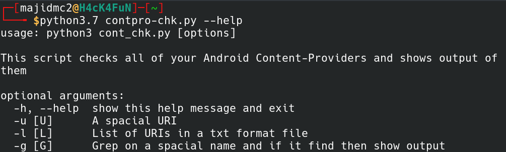

```                       
                  _                                _     _    
   ___ ___  _ __ | |_ _ __  _ __ ___           ___| |__ | | __
  / __/ _ \| '_ \| __| '_ \| '__/ _ \         / __| '_ \| |/ /
 | (_| (_) | | | | |_| |_) | | | (_) |       | (__| | | |   < 
  \___\___/|_| |_|\__| .__/|_|  \___/  _____  \___|_| |_|_|\_\
                     |_|              |_____|              

```                       

## About
This script helps you on Android protesting when you want to send queries to some ***Android Content-Provider***. This script can check a URI or a list of them and also if you are looking for a special text, it can show the output by grabbing it.

----
## Installation
####Requirements
> Python3.*

####Run
At first you should clone the repositoty
> git clone 

Then run contpro-chk.py by **Python3.***
> cd contpro-chk
> python3.7 contpro-chk.py --help

Output of help:



----

## TODO

- [x] Send Query
    - [x] a URI
    - [x] a list of URIs
- [x] Grab a special text in the output
- [ ] Find all content-providers in smali codes
